# aula08
<h1>Exercício 01</h1>

// @ts-nocheck
/**
 * Função "verificarIdade" irá averiguar se uma pessoa
 * é maior ou menor de idade de acordo com um número.
 * 
 * Parâmetro number num
 * @param {*} num
 * 
 * retorna uma string de acordo com o parâmetro.
 * Se o número não for inserido, o retorno irá pedir
 * pedir para inserir um número.
 * @returns 
 */
 
 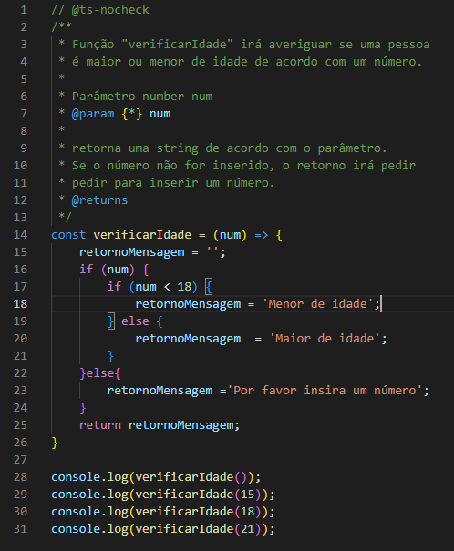

 <h3>Resultado</h3>

 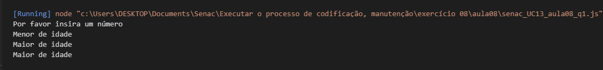

 <h1>Exercício 02 </h2>

 // @ts-nocheck
/**
 * Função "definirDiaDaSemana" irá imprimir uma string
 * do dia da semana de acordo com o número passado que
 * correspondem de 1 a 7, respectivamente, equivalem
 * aos dias.
 * 
 * Parâmetro number dia
 * @param {*} dia 
 * 
 * retorna uma string de acordo com o número. Se o 
 * número não estiver entre 1 e 7. O retorno será
 * "número inválido".
 * @returns 
 */

 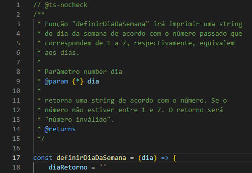
 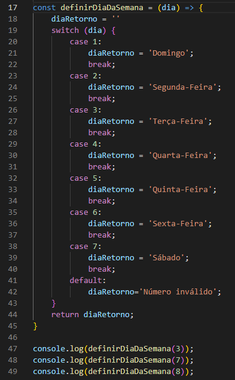
 
 <h3>Resultado</h3>

 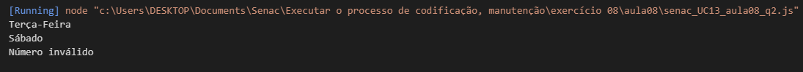

 <h1>Exercício 03 </h1>

 // @ts-nocheck
/**
 * Função "parOuImpar" irá avaliar se um número é par ou impar.
 * 
 * parâmetro number num
 * @param {*} num 
 * 
 * retorna string contendo o resultado da condição.
 * @returns 
 */

 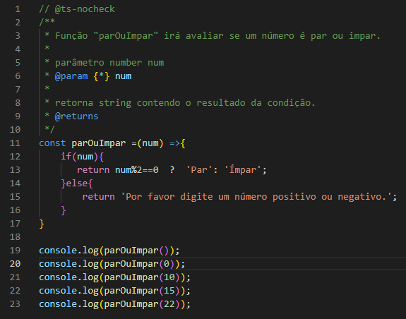

 <h3> Resultado </h3>

 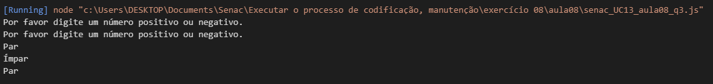

 <h1> Exercício 04 </h1>

 //@ts-check
/**
 * Objeto Usuário. 
 * 
 * propriedade number idade.
 * @param {*} idade 
 * 
 * propriedade boolean isAdmin
 * @param {*} isAdmin
 *  
 * propriedade boolean isBlocked
 * @param {*} isBlocked 
 */

 //@ts-check
/**
 * Funcção "podeAcessar" é uma função que irá avaliar a 
 * permição do usuário de acordo com as propriedades do
 * objeto de "Usuario";
 * 
 * objeto usuario
 * @param {*} usuario 
 * 
 * return false ou true.
 * @returns 
 */

 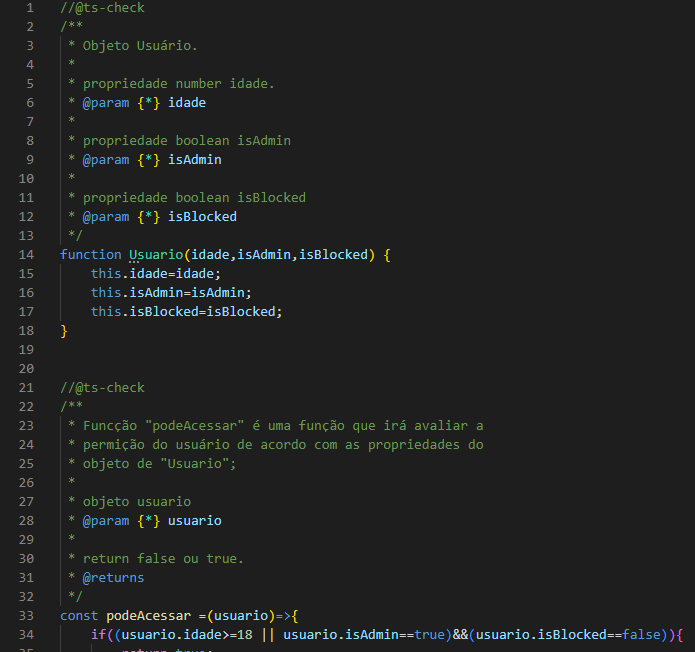

 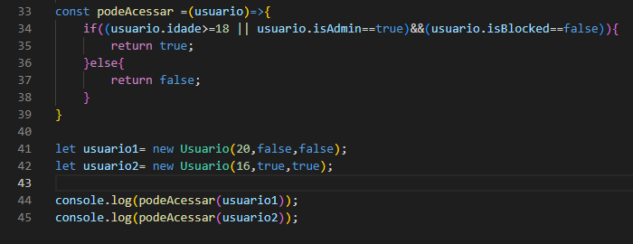

 <h3>Resultado</h3>

 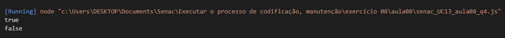

 <h1>Exercício 05 </h1>

 //@ts-check
/**
 *Essa função retorna o valor do desconto de acordo com os parâmetros de preço e porcentagem. 
 * 
 * parâmetro number preco
 * @param {number} preco 
 * 
 * parâmetro number porcentagem
 * @param {*} porcentagem 
 * 
 * retorno do cálculo de desconto do preço em relação a porcentagem.
 * @returns 
 * 
 */

 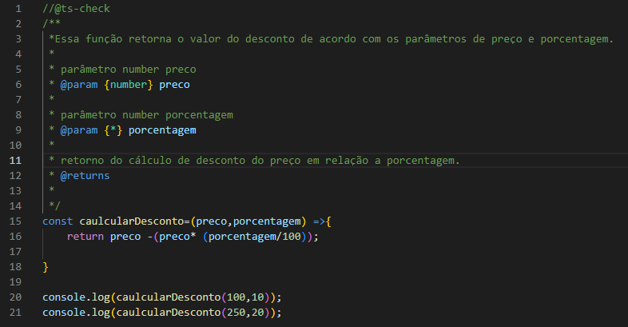

 <h3>Resultado</h3>
 
 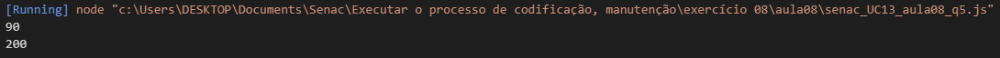